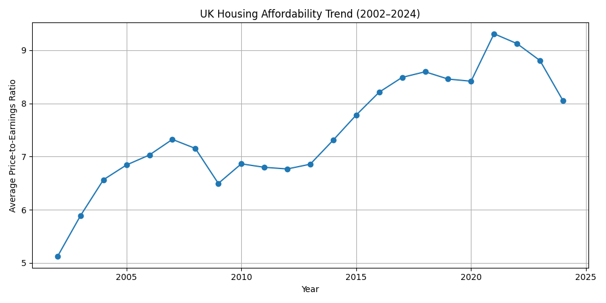
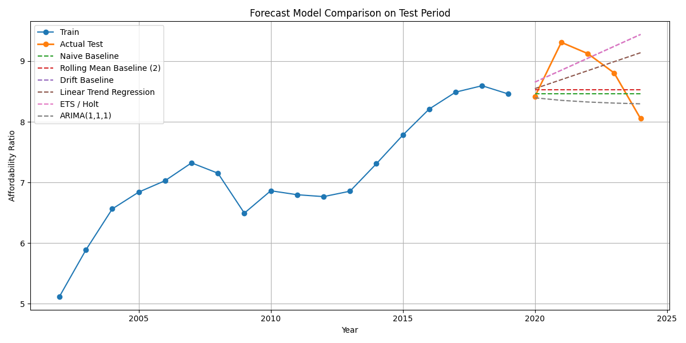
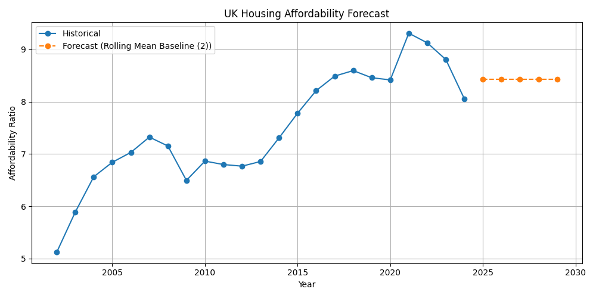
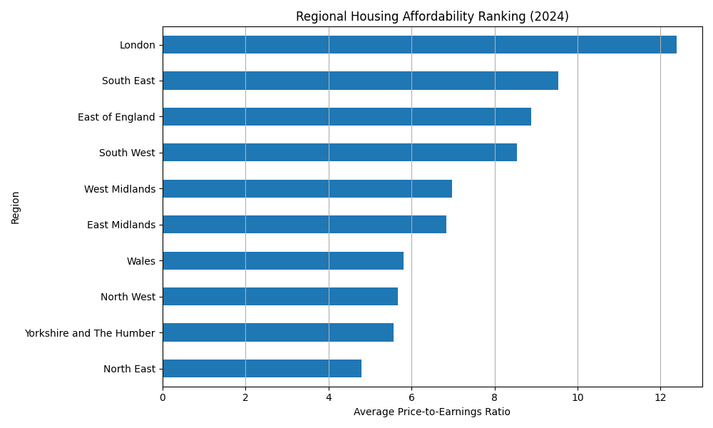
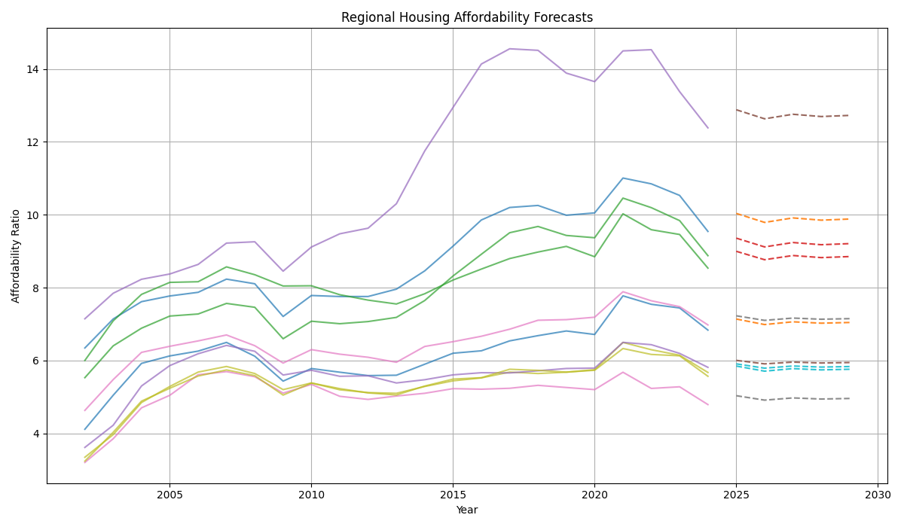

# 🏠 UK Housing Affordability Analysis

## 📌 Project Overview
This project analyses housing affordability trends across the UK using data from the Office for National Statistics (ONS).

It explores how house prices relate to earnings over time and across regions, and applies time-series forecasting to understand future affordability trends.

---

## 🎯 Objectives
- Analyse long-term housing affordability trends (2002–2024)  
- Identify regional differences in affordability  
- Evaluate forecasting models for affordability prediction  
- Forecast future affordability trends (2025–2029)  
- Translate findings into actionable insights for decision-making  

---

## 🗂️ Data Sources
- Office for National Statistics (ONS)  
- Land Registry Price Paid Data  
- Annual Survey of Hours and Earnings (ASHE)  

---

## 🛠️ Tools & Technologies
- Python (Pandas, NumPy, Statsmodels, Scikit-learn)  
- Tableau (dashboard development)  
- SQL (data handling)  

---

## 🔍 Data Processing & Quality

- Integrated multiple ONS datasets (prices, earnings, affordability ratios)  
- Converted wide-format data into time-series format  
- Aligned financial years to calendar years  
- Validated merge integrity across 318 local authorities  
- Identified and handled missing data transparently  

### 📊 Final Dataset
- **Rows:** 7,255  
- **Local Authorities:** 318  
- **Regions:** 10  
- **Time Period:** 2002–2024  

---

## 📊 Key Insights

- Housing affordability increased from **5.12 in 2002** to **8.05 in 2024**  
- House prices have consistently grown faster than earnings  
- Significant regional disparities exist across the UK  
- Income-based affordability measures show higher pressure than earnings-based measures  
- Average affordability gap: **0.75**  

👉 Indicates a **structural affordability challenge**

---

## 📈 UK Time-Series Analysis

### Trend Overview

- Strong upward trend in affordability ratio  
- Low volatility and high persistence  

---

## 🤖 Forecasting Analysis

### Model Comparison

| Model | RMSE |
|------|------|
| Rolling Mean (Best) | **0.51** |
| Naive | 0.54 |
| Linear Regression | 0.58 |
| ARIMA | 0.61 |

👉 **Best Model:** Rolling Mean Baseline (window = 2)

---

### 🔮 5-Year Forecast (UK)

- 2024 affordability: **8.05**  
- Forecast (2029): **8.43**  

👉 No strong improvement expected

---

## 🌍 Regional Analysis

### Regional Ranking

- Least affordable: **London, South East**  
- Most affordable: **North East**  

---

### Regional Forecasts

- All regions show continued affordability pressure, with minor fluctuations but no sustained downward trend  

---

### Model Performance by Region

| Metric | Value |
|------|------|
| Avg RMSE | 0.57 |
| Best Region | North East |
| Worst Region | London |

👉 London shows **higher volatility and complexity**

---

## 🔍 UK vs Regional Comparison

- UK model RMSE: **0.51**  
- Regional average RMSE: **0.57**

👉 Aggregation smooths variability, while regional models reveal underlying inequality and variability  

---

## 📌 Interpretation for Decision-Makers

- Housing affordability is a **long-term structural issue**  
- Forecasts indicate **continued pressure without intervention**  
- Regional differences require **targeted policy approaches**  
- London requires **more complex modelling and targeted interventions**  

---

## 💡 Business Value

This project demonstrates how data can:
- Support housing policy evaluation  
- Inform investment and planning decisions  
- Translate complex data into clear insights  
- Enable data-driven decision-making  

---

## 🧠 Skills Demonstrated
- Data cleaning & transformation  
- Exploratory data analysis (EDA)  
- Time-series modelling & forecasting  
- Model validation (holdout + walk-forward)  
- Regional analysis  
- Data storytelling  

---

## 🚀 Future Improvements
- Incorporate rental and demographic data  
- Apply advanced models (Prophet, LSTM)  
- Deploy interactive dashboards  
- Build real-time data pipeline  

---

## 📬 Contact
- 📧 Email: imeshabandara@gmail.com  
- 💼 LinkedIn: https://www.linkedin.com/in/imeshabandara/
