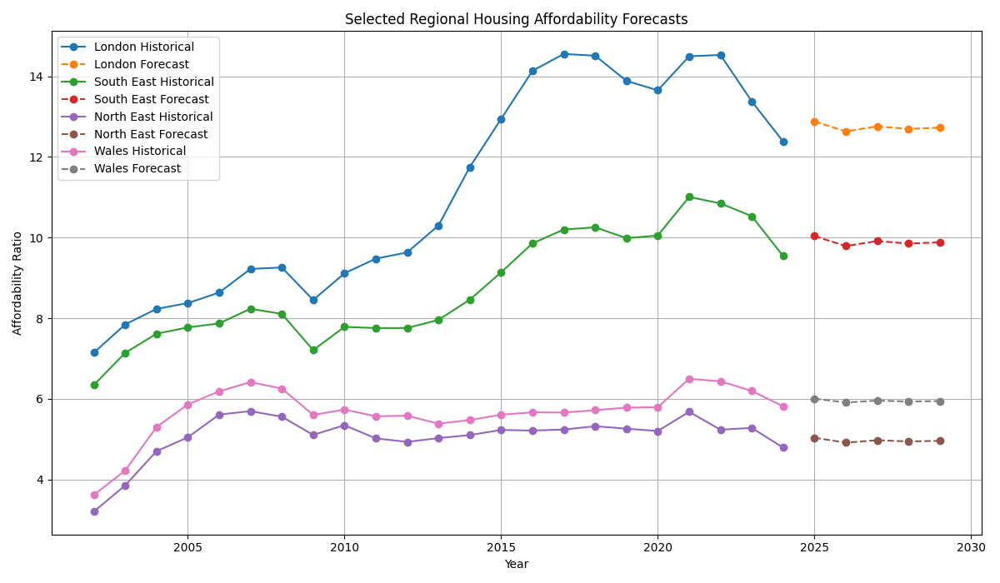

# 🏠 UK Housing Affordability Analysis

## 📌 Project Overview
This project analyses housing affordability trends across the UK, focusing on the relationship between house prices and earnings over time and across regions.

The objective is to generate clear, data-driven insights and forecasts that help understand affordability challenges and support evidence-based decision-making.

---

## 🎯 Objectives
- Analyse long-term trends in housing affordability across UK regions  
- Identify key drivers influencing affordability changes  
- Quantify regional disparities in housing access  
- Develop time-series forecasts to understand future affordability trends  
- Present insights through clear and interactive visualisations  

---

## 🗂️ Data Sources
- Office for National Statistics (ONS)  
- UK housing price datasets  
- Earnings and affordability metrics  

---

## 🛠️ Tools & Technologies
- **Python** (Pandas, NumPy, Matplotlib, Scikit-learn, Statsmodels)  
- **Tableau** (Interactive dashboard development)  
- **SQL** (Data extraction and preparation)  

---

## 🔍 Key Analysis Performed

### 📊 Exploratory Data Analysis (EDA)
- Cleaned and integrated multi-source datasets  
- Analysed affordability trends over time  
- Compared regional affordability levels  
- Identified patterns in price-to-income ratios  

---

### ⏱️ Time-Series Modelling & Forecasting
- Built UK-level time series of affordability ratios  
- Evaluated multiple forecasting models:
  - Naive baseline  
  - Rolling mean baseline  
  - Drift model  
  - Linear regression  
  - Exponential smoothing (ETS)  
  - ARIMA  

- Compared model performance using MAE and RMSE  
- Selected the best-performing model for forecasting  

---

### 🌍 Regional Forecasting
- Developed region-level time series models  
- Applied **rolling mean forecasting with walk-forward validation**  
- Evaluated model performance across regions  
- Generated **5-year forecasts per region**  

---

## 📊 Key Insights

### 📉 1. Affordability is structurally worsening
- The affordability ratio has increased steadily over time, indicating that **house prices are rising faster than earnings**
- This reflects a long-term structural imbalance in the UK housing market  

---

### 🌍 2. Strong regional inequality persists
- Regions such as **London and the South East consistently show the highest affordability ratios**
- Northern regions (e.g., North East) remain relatively more affordable but still show upward pressure  

👉 Highlights a **geographic divide in housing access**

---

### 📈 3. Forecasts indicate continued pressure
- Forecasts suggest affordability will **remain high or worsen over the next 5 years**
- No strong reversal trend is observed  

---

### ⚙️ 4. Simple models performed strongly
- The **rolling mean baseline model** performed competitively compared to complex models  
- Indicates affordability trends are **highly persistent and trend-driven**  

---

### 📊 5. Trend-driven system
- The time series shows smooth upward movement rather than sharp fluctuations  
- Suggests **systemic economic drivers rather than short-term shocks**  

---

### 💡 6. Key drivers
- Income growth stagnation  
- Rising house prices  
- Regional economic differences  

---

## 📌 Interpretation for Decision-Makers

- **Persistent affordability decline** suggests a structural imbalance between house prices and earnings, requiring **long-term housing supply and pricing interventions**

- **Regional disparities** highlight the need for **location-specific policy strategies**

- **Forecast trends** indicate affordability challenges will persist, requiring **proactive planning**

- The effectiveness of **trend-based models** shows affordability dynamics are **predictable and persistent**, supporting **reliable forecasting**

- These insights can support:
  - Government housing policy decisions  
  - Urban planning and infrastructure investment  
  - Financial and property market analysis  

---

## 📈 Dashboard & Visualisation

### 🔹 UK Affordability Forecast

---

### 🔹 Model Comparison

---

### 🔹 Regional Forecasts

---

### 🔹 Selected Regions Comparison

---

## 💡 Business Value

This project demonstrates how data can be used to:

- Translate complex datasets into clear, actionable insights  
- Support policy evaluation and decision-making  
- Communicate findings effectively to non-technical stakeholders  
- Enable data-driven planning in housing and economic contexts  

---

## 🧠 Skills Demonstrated
- Data cleaning and transformation  
- Exploratory data analysis (EDA)  
- Time-series modelling and forecasting  
- Model evaluation (MAE, RMSE)  
- Data visualisation and dashboard design  
- Insight generation and storytelling  

---

## 🚀 Future Improvements
- Incorporate rental and demographic datasets  
- Apply advanced forecasting models (e.g., Prophet, LSTM)  
- Deploy dashboard for stakeholder use  
- Integrate real-time data pipelines  

---

## 📬 Contact
If you'd like to discuss this project or collaborate:

- 📧 Email: imeshabandara@gmail.com  
- 💼 LinkedIn: https://www.linkedin.com/in/imeshabandara/
